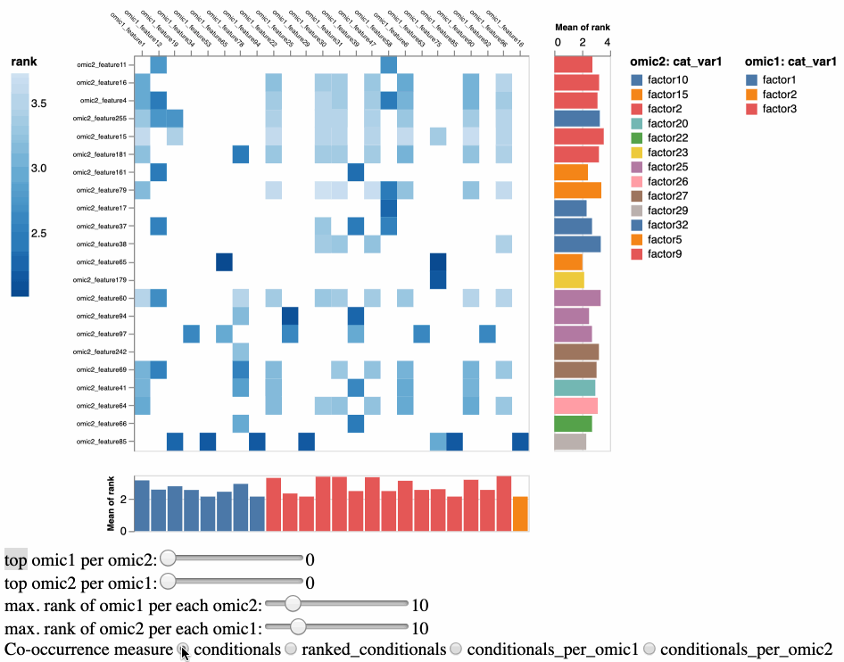
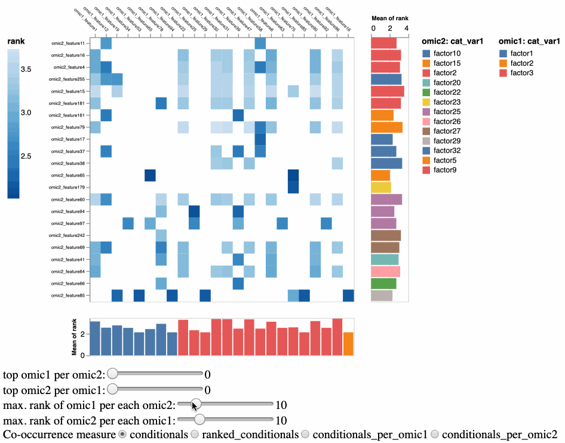
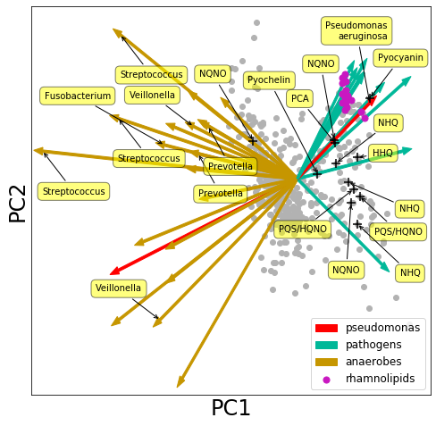
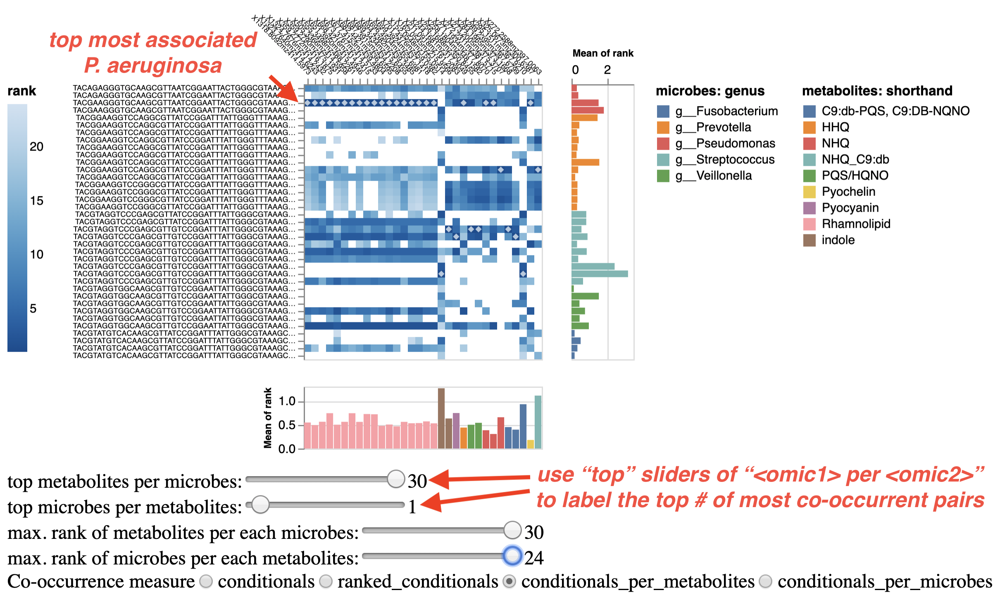

# Xmmvec

Interactive Visualization tool to explore for the values and ranks of the values 
in a mmvec (or other) matrix of numbers, using selections based on these values 
and ranks as well as metadata associated with the features in row and/or columns 
of the matrix.

## Installation

For the first install:
```
pip install git+https://github.com/FranckLejzerowicz/Xmmvec.git
```

and then if there are updates...
```
pip install --upgrade git+https://github.com/FranckLejzerowicz/Xmmvec.git
```

*_Note that python and pip should be python3_

## Input
    
* Data files:
  - `-r, --i-ranks-path`: mmvec output matrix of conditional probabilities between the omic1 
features and omic2 features

* Output:
  - `-o, --o-ranks-explored` (optional): Xmmvec visualization output (must end with be .html)  

* Metadata:
  - `-m1, --p-omic1-metadata` and `-m1, --p-omic1-metadata` (optional): feature metadata tables 
  for 'omic1' and 'omic2' features. Must contains the passed columns (next option) or ignored.
  - `-c1, --p-omic1-column` and `-c2, --p-omic2-column` (optional): columns of the respective
  metadata tables to use for features coloring.
  - `-n1, --p-omic1-name` and `-n2, --p-omic2-name` (optional): names to identify the 'omic1' 
  and 'omic2' features (and label the interactive selectors). This is invented and maz not match
  the data (e.g. "*myGenomes*" would work). 

* Filtering (based on metadata):
  - `-f1, --p-omic1-filt` and `-f2, --p-omic2-filt` (optional): column of the 'omic1' (and/or 'omic2') 
  features metadata table passed to `-m1, --p-omic1-metadata` (and/or `-m2, --p-omic2-metadata`) that  
  is used for features filtering.  
  - `-v1, --p-omic1-value` and `-v2, --p-omic2-value` (optional): factor(s) (or absolute threshold(s)) for columns
  `-f1, --p-omic1-filt` (and/or `-f2, --p-omic2-filt`) used to filter the features.
  - `-q1, --p-omic1-quant` and `-q2, --p-omic2-quant` (optional): Quantile (or relative threshold(s)) for columns
  `-f1, --p-omic1-filt` (and/or `-f2, --p-omic2-filt`) used to filter the features. If the column is numerical, 
  specify a quantile moment to subset for features having values >= to the quantile value, for example to only see
  the co-occurrences with the features that are the most associated with a songbird differentials column!
  - `-l1`, `--p-omic1-list` and `-l2`, `--p-omic2-list` (optional): lists of features (or regex to match 
  features) to subset for.
  - `-x1, --p-omic1-max` and `-x2, --p-omic2-max` (optional): maximum number of top co-occurrences to 
  show per feature (not very useful sine in the end there's a good chance that the unique omic1 and omic2
  features sets are still very large).

The names of the paired omics can be invented (using `-n1` and `-n2`), 
but note that the features in:
  - the columns of the matrix will be associated with options `1` (`-m1`, `-c1`, `-n1`, `-f1`, `-v1`).
  - the rows of the matrix will be associated with options `2` (`-m2`, `-c2`, `-n2`, `-f2`, `-v2`).

* Parameters:
  - `-p, --p-min-probability` (optional): set a threshold to remove co-occurrences associated
  with conditional probabilities below this threshold.
  - `-n, --p-pair-number` (optional): a number of top co-occurrences to initialize the plot.  
  - `-col, --p-color-palette` (optional): color map for the heatmap of conditional probabilities (or 
  ranked conditional probabilities).
 
## Outputs

A vizualization file in html containing three interactive panels:
1. a heatmap of conditional probability values (or ranked values upon selection)
2. a barplot for the features of 'omic1' average probabilities: there to use shift + click bars to highlight features 
2. a barplot for the features of 'omic2' average probabilities (same functionality). 

(hover over the heatmap cells or bars to get additional information)

#### Sliders

The sliders allows one to only show on the heatmap the co-occurrences probabilities that for each\
feature are the most highly ranked (i.e. setting a slider to 10 would subset to the top 10 
co-occurring features of an axis for each feature on the other axis):
- The first slider controls the co-occurring features of omic1 for each feature of omic2.   
- The second slider controls the co-occurring features of omic2 for each feature of omic1.   

#### Selectors

On the very bottom, there are four selectors under label `Conditional_conditional`. This is to 
toggle the data in the heatmap in terms of:
- `conditionals`: raw conditional probability values.
- `ranked_conditionals`: raw conditional probability values ranked from the smallest to the 
largest (i.e. across the board).
- `conditionals_per_<omic1>`: conditional probability values ranked separately for each feature 
of *omic1*, from the least to the most probably co-occurring features of *omic2*.     
- `conditionals_per_<omic2>`: conditional probability values ranked separately for each feature 
of *omic2*, from the least to the most probably co-occurring features of *omic1*.     


## Usage

Say you have this co-occurrences conditional probabilities table:

|  | omic1_feature0 | omic1_feature1 | omic1_feature2 | omic1_feature3 | ... | omic1_featuren |
| :---:  | :---: | :---: | :---: | :---: | :---: | :---: |
| omic2_feature0 | 1.636361 | 2.019793 | 0.779007 | 0.779007 | ... | 0.058756 |
| omic2_feature1 | -0.190842 | -0.114221 | 0.072174 | 0.072174 | ... | 0.57362 |
| omic2_feature2 | 0.984774 | 0.871110 | 0.717266 | 0.717266 | ... | 0.056844 |
| omic2_feature3 | -0.190842 | -0.114221 | 0.072174 | 0.072174 | ... | 2.93982 |
| ... | ... | ... | ... | ... | ... | ... |
| omic2_featuren | 2.241402 | 2.253651 | 1.642426 | 1.642426 | ... | 0.096842 |

First, note it is possible to tell Xmmvec to only show the co-occurrences associated with conditional
probabilities of more than a given threshold (use `-p, --p-min-probability`). This may effectively remove
entire row/columns and make the plot more easy to explore. For example, using `-p 1`, would basically 
make Xmmvec to work with this subtable:     

|  | omic1_feature0 | omic1_feature1 | omic1_feature2 | omic1_feature3 | ... | omic1_featuren |
| :---:  | :---: | :---: | :---: | :---: | :---: | :---: |
| omic2_feature0 | 1.636361 | 2.019793 | 0.779007 | 0.779007 | ... | 0.058756 |
| omic2_feature3 | -0.190842 | -0.114221 | 0.072174 | 0.072174 | ... | 2.93982 |
| ... | ... | ... | ... | ... | ... | ... |
| omic2_featuren | 2.241402 | 2.253651 | 1.642426 | 1.642426 | ... | 0.096842 |

We will use the simple example of this package:

* [`ranks_test.tsv`] features of omic1 are labelled *omic1_feature#* and that of omic2, *omic2_feature#*. Here's the first 
cellsof the matrix (note that omic1 features Are in columns and omic2's in rows).  

    | | omic1_feature0 | omic1_feature1 | omic1_feature2 | ... | 
    | :---: | :---: | :---: | :---: | :---: |
    | omic2_feature0 | 1.6363606031615694 | 2.019792619120501 | 0.7790071014082969 | ... | 
    | omic2_feature1 | 2.241402154115007 | 2.2536513233353035 | 1.642426395765597 | ... | 
    | omic2_feature2 | 0.9847736657155712 | 0.8711101258991643 | 0.7172655705130637 | ... | 
    | ... | ... | ... | ... | ... | 

* [`omic1_metadata.tsv`] and [`omic2_metadata.tsv`] are features metadata tables for omic1 and omic2, respectively,   

    e.g for omic1:

    | Feature ID | num_var | cat_var1 | cat_var2 |
    | :---: | :---: | :---: | :---: |
    | omic1_feature0 | -0.0775126805232021 | factor0 | factor0 |
    | omic1_feature1 | 0.0265196049882916 | factor1 | factor1 |
    | omic1_feature2 | -0.0764886449026989 | factor2 | factor2 |
    | ... | ... | ... | ... |


Running:

    ```
    Xmmvec \
        -r Xmmvec/tests/example/ranks_test.tsv \
        -p 2 \
        -m1 Xmmvec/tests/example/omic1_metadata.tsv \
        -n1 omic1 \
        -c1 cat_var1 \
        -f1 cat_var2 \
        -v1 factor1 -v1 factor2 -v1 factor3 \
        -m2 Xmmvec/tests/example/omic2_metadata.tsv \
        -n2 omic2 \
        -c2 cat_var1 \
        -f2 cat_var2 \
        -v1 factor2 -v1 factor3 -v1 factor4 \
    ```
Would return file `Xmmvec/tests/example/ranks_test-p2.0-n10.html` with 'omic1' and 'omic2' as 
columns and rows in the interactive heatmap coloured per values.

If no output file name is specified, the input filename is stripped from its extension,
which is replaced by the values of options `-p, --p-min-probability` and `-n, --p-pair-number`,
and the `.html` extension.

## Visualization

* Change scale of conditional probability values:
    - *conditionals*: raw
    - *ranked_conditionals*: ranked across matrix
    - *conditionals_per_<omic1_name>*: ranked omic2 features per omic1 feature
    - *conditionals_per_<omic2_name>*: ranked omic1 features per omic2 feature
    
    

* Select features by clicking on the marginal bars (hold shift for multiple selection and double-click to reset) 
    
    

* Label the top most associated omic1 (or omic2) features for each feature of omic2 (or omic1).
    Two sliders:
    - *top <omic1_name> per <omic2_name>*
    - *top <omic2_name> per <omic1_name>*
    _*ATTENTION*: To see all the top co-occurrences for one slide, set the other slider to maximum (as they both apply to 
    filter the data)_
    
    

* Change total number of top-ranked omic1 (or omic2) features for each feature of omic2 (or omic1).
    Two sliders:
    - *max. rank of <omic1_name> per each <omic2_name>*: it makes more sense to view the ranks on the heatmap as
    *conditionals_per_<omic2_name>*
    - *max. rank of <omic2_name> per each <omic1_name>*: it makes more sense to view the ranks on the heatmap as
    *conditionals_per_<omic1_name>*
    
    

## Example

The CF dataset from [Morton et al. 2019](https://www.nature.com/articles/s41592-019-0616-3) can be used as a reference.
One can provide lists of terms to search in each of the omic1 or omic2 features metadata in order to subset the matrix
of co-occurrences for these features.

In this paper was found that _Pseudomonas aeruginosa_ co-occurs with rhamnolipids:


 
For more insights about where these terms where picked from, please see 
[this notebook](https://github.com/knightlab-analyses/multiomic-cooccurrences/blob/master/ipynb/Figure4-cystic-fibrosis.ipynb) 
associated with this paper.

Running the following command on the `ranks.tsv` table from this paper and using the associated feature metadata
 
    ```
    Xmmvec \
        -r Xmmvec/tests/cf/ranks.tsv \ 
        -m1 Xmmvec/tests/cf/point-metadata.txt \ 
        -n1 metabolites \
        -c1 shorthand \
        -f1 shorthand \
        -r1 Xmmvec/tests/cf/point_regex_shorthand.txt \
        -n2 microbes \
        -m2 Xmmvec/tests/cf/arrow-metadata.txt \ 
        -c2 genus \
        -f2 genus \
        -r2 Xmmvec/tests/cf/arrow_regex_genus.txt
    ```

One obtains this result, with showing the co-occurrences colored in terms of rank per metabolite, and the 10 top 
co-occurrent metabolites per microbe. Clearly, _P. aeruginosa_ is the most associated microbe for all rhamnolipids, and one _P. aeruginosa_ feature 
is in fact *the* top most associated with all rhamnolipids.



### Optional arguments

```
  -r, --i-ranks-path TEXT         Path to mmvec ranks.  [required]
  -o, --o-ranks-explored TEXT     Path to the output explorer visualization.
  -t, --i-tree-taxonomy TEXT      Path to a tree which internal nodes are
                                  labeled.

  -m1, --p-omic1-metadata TEXT    {Path to the metadata table for omic1
                                  features (columns of the ranks matrix).

  -c1, --p-omic1-column TEXT      Column from metadata to use for
                                  stratification of omic1 features.

  -f1, --p-omic1-filt TEXT        Column from metadata `-m1` to use for
                                  filtering based on values of `-v1`.

  -v1, --p-omic1-value TEXT       Filtering value for omic1 features based on
                                  column passed to `-f1`.

  -r1, --p-omic1-value-regex TEXT
                                  Path to a list of omic1 regex to subset from
                                  column passed to `-f1` (regex accepted).

  -q1, --p-omic1-quant INTEGER    Filtering percentile for omic1 features
                                  based on column passed to `-f1` (must be
                                  between 0 and 100).

  -n1, --p-omic1-name TEXT        Name for omic1 features.  [default: omic1]
  -l1, --p-omic1-list TEXT        List of omic1 features to subset (regex
                                  accepted).

  -x1, --p-omic1-max INTEGER      Maximum number of co-occurrences per omic1
                                  feature.  [default: 0]

  -m2, --p-omic2-metadata TEXT    {Path to the metadata table for omic2
                                  features (rows of the ranks matrix).

  -c2, --p-omic2-column TEXT      Column from metadata to use for
                                  stratification of omic2 features.

  -f2, --p-omic2-filt TEXT        Column from metadata `-m2` to use for
                                  filtering based on values of `-v2`.

  -v2, --p-omic2-value TEXT       Filtering value for omic2 features based on
                                  column passed to `-f2`.

  -r2, --p-omic2-value-regex TEXT
                                  Path to a list of omic2 regex to subset from
                                  column passed to `-f1` (regex accepted).

  -q2, --p-omic2-quant INTEGER    Filtering quantile / percentile for omic2
                                  features based on column passed to `-f2`
                                  (must be between 0 and 100).

  -n2, --p-omic2-name TEXT        Name for omic2 features.  [default: omic2]
  -l2, --p-omic2-list TEXT        List of omic2 features to subset (regex
                                  accepted).

  -x2, --p-omic2-max INTEGER      Maximum number of co-occurrences per omic2
                                  feature.  [default: 0]

  -p, --p-min-probability FLOAT   Minimum conditional probability.  [default:
                                  0.0]

  -n, --p-pair-number INTEGER     initial number of co-occurrences per
                                  feature.  [default: 10]

  -col, --p-color-palette [blues|greens|oranges|reds|purples|greys|viridis|magma|inferno|plasma|bluegreen|bluepurple|greenblue|orangered|purplebluegreen|purpleblue|purplered|redpurple|yellowgreenblue|yellowgreen|yelloworangebrown|yelloworangered|blueorange|brownbluegreen|purplegreen|pinkyellowgreen|purpleorange|redblue|redgrey|redyellowblue|redyellowgreen|spectral|rainbow|sinebow]
                                  Color palette for the heatmap.  [default:
                                  blues]

  -top, --p-color-top TEXT        Color for the top co-occurrences labels.
                                  [default: white]

  --verbose / --no-verbose
  --version                       Show the version and exit.
  --help                          Show this message and exit.
```

### Bug Reports

contact `flejzerowicz@health.ucsd.edu`